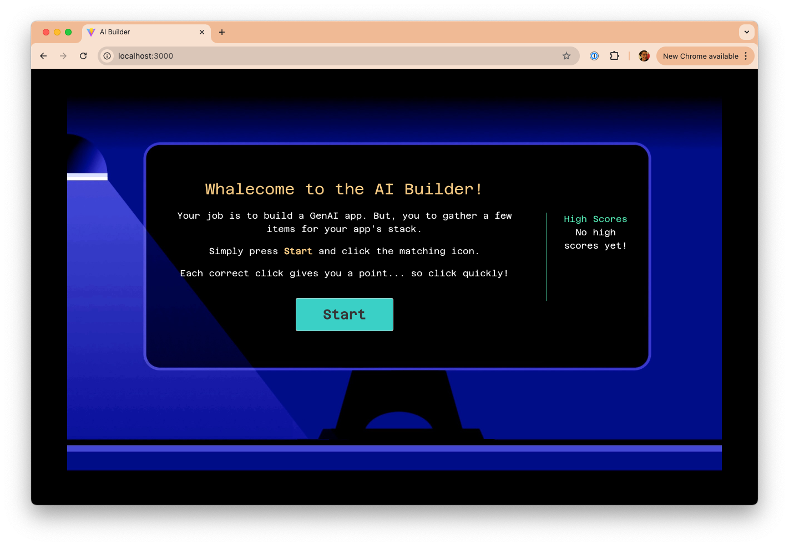
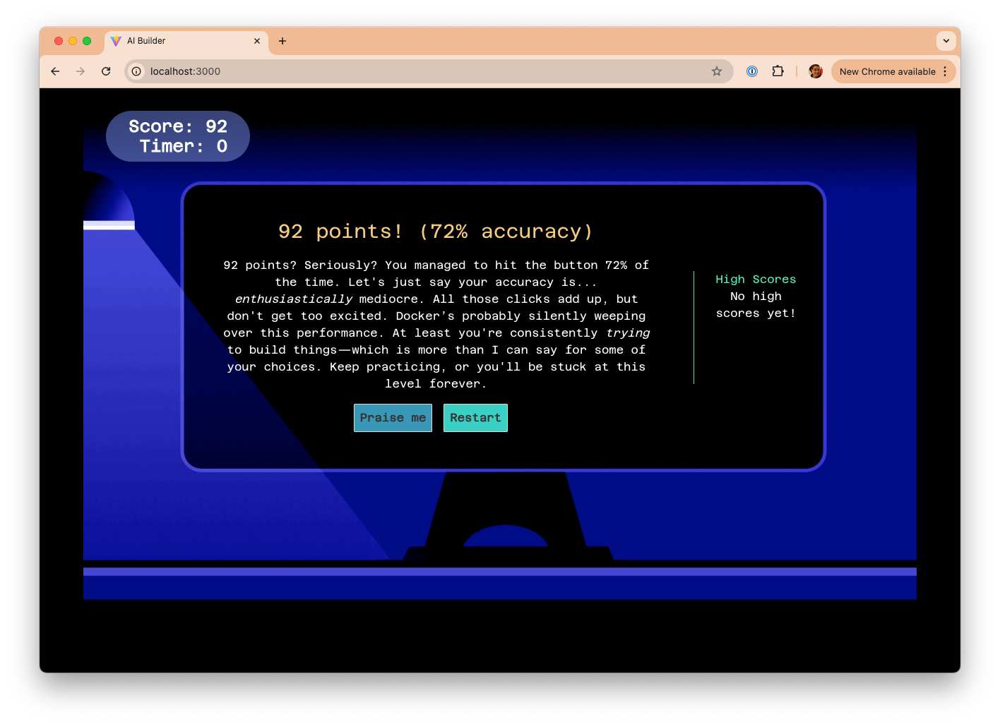

# AI Builder

AI Builder is a simple "clicker-style" game in which the user will click a button as fast as they can to get points.

The game focuses around the components needed to build a GenAI application - models, tools, prompts, and packaging.

It also includes:

- **High score tracking** - keeps the top ten high scores, making it a fun and competitive experience
- **Roast or praise me** - after you play the game, get a GenAI-created roast or praise based on your performance

|  |  |
|:---------------------------------------------------------------:|:------------------------------------------------------------------------------------------------:|
| **The game's start screen**                         | **The end of the game with a Gen-AI created roast**                            |

## Try it out

**Pre-reqs:** You will need **Docker Desktop 4.43+** or Docker Engine with the [Docker Model Runner plugin](https://docs.docker.com/ai/model-runner/) and Compose 2.38.1+. 

Run the following command:

```
docker compose -f oci://dockersamples/ai-builder-game:compose up
```

The app uses the `ai/gemma3:4B-Q4_0` model, which is ~2.2GB in size. If you don't have it yet, Compose will download it for you.

Once everything has started, open your browser to http://localhost:3000 and have fun!

## Acknowledgements

This project is heavily inspired by the [Finicky Whiskers game](https://github.com/fermyon/finicky-whiskers/) made by [Fermyon](https://www.fermyon.com/)